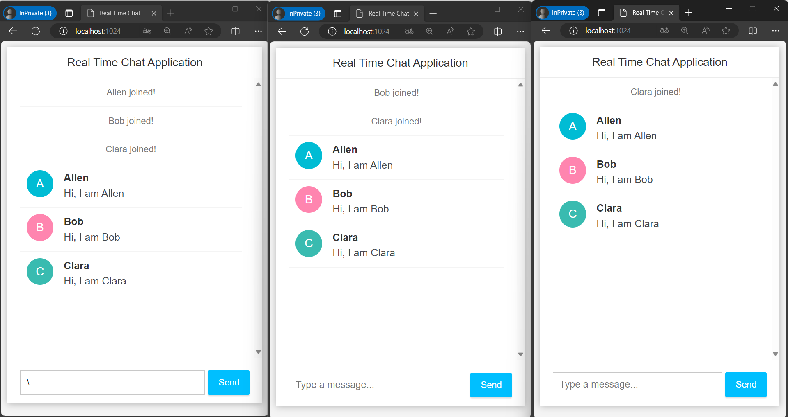

# Real Time Chat App

### Introduction
This is a Spring project which uses Spring Boot, lombok, html, javascript and css to implement a real time chat application. 
This app is run on <b> port 1024</b>. You can open multiple web pages from the browser and join the chat to see how it is going. 

This project uses web socket to establish the communication. 

### Chat Example

### Possible Improvements
* Dockerize the project to my dockerhub
* Create a more appealing page using vue instead of pure <i> html & css & javascript </i>.

